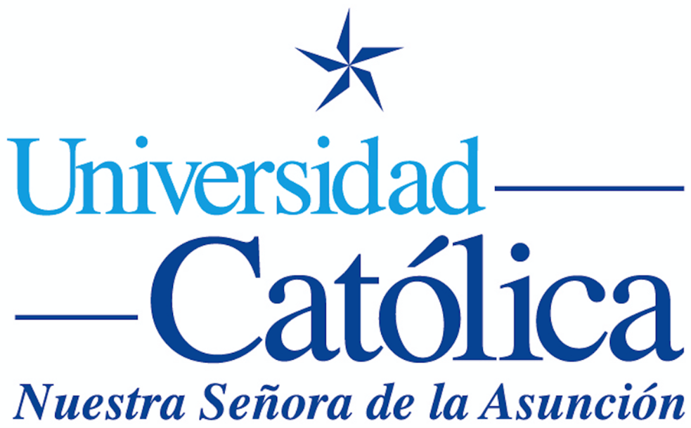

  

# UNIVERSIDAD CATÓLICA “NUESTRA SEÑORA DE LA ASUNCIÓN”
**FACULTAD DE CIENCIAS Y TECNOLOGÍA**  
**CARRERA DE ANÁLISIS DE SISTEMAS INFORMÁTICOS**

---

# ANTEPROYECTO DE TESIS  
**“Sistema Web para la Escuela y Orquesta de Instrumentos Reciclados de Cateura con Integración de Accesibilidad Digital”**

## RESPONSABLES
- Insfrán Caballero Emmanuel, CO6613  
- Insfrán Caballero Miguel Ángel, CO6511

## TUTOR
Prof. Lic. Raul Larreinegabe

**Abril 2024**

---

## Contenido

1. [Integrantes del Grupo de Tesis](#integrantes-del-grupo-de-tesis)
2. [Título del Trabajo](#título-del-trabajo)
3. [Justificación del Trabajo](#justificación-del-trabajo)
4. [Descripción del Trabajo](#descripción-del-trabajo)
5. [Alcance](#alcance)
6. [Esquema de Gráfico del Trabajo](#esquema-de-gráfico-del-trabajo)
7. [Cronograma de Tareas](#cronograma-de-tareas)
8. [Referencias](#referencias)

---

## Integrantes del Grupo de Tesis

- Insfrán Caballero Emmanuel, CO6613  
- Insfrán Caballero Miguel Ángel, CO6511

---

## Título del Trabajo

**Desarrollo de un Portal Web para la Orquesta de Instrumentos Reciclados de Cateura Adaptado a Usuarios No Videntes**

---

## Justificación del Trabajo

El presente anteproyecto de tesis propone el desarrollo de un sistema web para la Escuela y Orquesta de Instrumentos Reciclados de Cateura en Paraguay, con el objetivo de modernizar y optimizar la gestión de su escuela de música, así como mejorar la difusión de sus actividades culturales. Esta iniciativa surge en respuesta a la necesidad imperante de la orquesta de contar con herramientas tecnológicas que no solo faciliten la administración eficiente de los recursos, sino que también fortalezcan la comunicación con la comunidad y promuevan la inclusión de todos los sectores.

Dada su naturaleza de organización sin fines de lucro y su enfoque en brindar oportunidades a niños y jóvenes de escasos recursos, la Escuela y Orquesta tiene que lidiar con varias dificultades. La falta de un sistema centralizado para el registro de alumnos, profesores e instrumentos ha generado dificultades logísticas en la coordinación de clases, asignación de recursos y seguimiento del progreso de los estudiantes. Además, la falta de información fácilmente accesible acerca de la Orquesta ha promovido que se pierdan oportunidades que podrían haber sido beneficiosas para la orquesta en otras circunstancias, al no tener un sitio web con información clara y un registro de sus actividades, ventajas y conciertos donde fueron siendo conocidos.

La digitalización de las inscripciones y la implementación de un sistema web permitiría que personas de bajos recursos puedan inscribirse de forma remota, eliminando las barreras geográficas y económicas que podrían impedirles acceder a la educación musical. Además, al proporcionar información detallada sobre los requisitos de ingreso y el funcionamiento de la escuela, se abrirían nuevas oportunidades para aquellos que de otra manera no tendrían acceso a este tipo de educación.

Por otra parte, la innovación tecnológica propuesta en este proyecto no solo abordará estas necesidades fundamentales, sino que también establecerá un estándar de excelencia en la gestión de proyectos culturales y educativos de nuestro país. Al desarrollar un sistema web accesible y fácil de usar, la Orquesta de Cateura podrá optimizar sus procesos internos, mejorar la experiencia de sus estudiantes y profesores, al mismo tiempo que aumenta su impacto en la sociedad y se da a conocer más en el ámbito web.

Al integrar los criterios de accesibilidad establecidos por las WCAG (Web Content Accessibility Guidelines), se garantizará que el sistema sea inclusivo y accesible para todas las personas, independientemente de sus capacidades o limitaciones. Este enfoque no solo cumpliría con estándares internacionales de accesibilidad, sino que también establecería un precedente en Paraguay, donde muy pocos, si no es ningún sitio web académico, cumple con estos criterios. Esto podría servir como inspiración y estandarización de los criterios de accesibilidad en el país, marcando un avance significativo en la inclusión digital.

---

## Descripción del Trabajo

El presente proyecto de tesis se centra en el desarrollo de un sistema web integral para la Orquesta de Instrumentos Reciclados de Cateura en Paraguay. Esta orquesta, reconocida mundialmente por su innovador enfoque en la música utilizando instrumentos construidos con materiales reciclados recolectados en la basura, cuenta con una Escuela de Música que busca promover la inclusión social y el desarrollo artístico de niños y jóvenes de bajos recursos en nuestro país, más específicamente en el Bañado Sur.

El sistema web propuesto tendrá dos componentes principales: una sección interna para la gestión administrativa de la escuela de música y una sección pública que servirá como plataforma informativa y de interacción para la comunidad, tanto de la Orquesta de Instrumentos Reciclados de Cateura como de su Escuela de Música.

En la sección interna, se implementará un sistema de registro digital para alumnos y profesores, facilitando el proceso de inscripción a la escuela. Los alumnos podrán ingresar sus datos personales, instrumento de preferencia, nivel de conocimientos musicales y, en caso de ser necesario, información sobre instrumentos propios. Además, se llevará un registro detallado del inventario de instrumentos disponibles, incluyendo su localización actual, historial de préstamos y condiciones de uso. Este sistema permitirá una gestión eficiente de los recursos y fomentará el aprendizaje musical al proporcionar instrumentos adecuados a los estudiantes.

La sección interna también incluirá herramientas para la gestión de audiciones, donde se evaluarán los conocimientos y habilidades de los alumnos con objetivos determinados, como la adquisición o préstamo de instrumentos y la capacidad de ascender en la orquesta de forma justa y clara.

En cuanto a la sección pública del sitio web, se ofrecerá un calendario en tiempo real que mostrará la ubicación y actividades de la orquesta, incluyendo conciertos y eventos futuros con la posibilidad de adquirir entradas en línea. También se presentará una lista de los integrantes de la Orquesta titular, acompañada de información y videos que reflejen su trayectoria y contribución a la música como miembros de esta agrupación.

Además, se habilitará una sección de donaciones donde los visitantes podrán contribuir económicamente a la orquesta y dejar comentarios junto con sus donaciones. Otra sección proporcionará información histórica y anecdótica sobre la fundación y desarrollo de la orquesta, mientras que una sección de materiales audiovisuales ofrecerá enlaces a conciertos grabados y otros contenidos multimedia alojados en plataformas externas.

Para el desarrollo del sistema, se empleará la metodología ágil debido a su flexibilidad y capacidad para adaptarse a los cambios y necesidades del proyecto en tiempo real. Esto garantizará una implementación eficiente y satisfactoria del sistema web, acorde con los objetivos y requerimientos de la Orquesta de Instrumentos Reciclados de Cateura.

Asimismo, se aplicarán las Pautas de Accesibilidad al Contenido Web (WCAG, por sus siglas en inglés), que son estándares internacionales para asegurar que el contenido web sea accesible para personas con discapacidades. Se buscará alcanzar el nivel AA de las WCAG, el cual incluye criterios adicionales de accesibilidad para proporcionar una experiencia óptima a un amplio rango de usuarios. Estos criterios se dividen en tres niveles: A, AA y AAA, siendo el nivel AA el más adecuado para garantizar un alto grado de accesibilidad sin comprometer la usabilidad del sitio web y el que implementaremos en este proyecto. Es necesario aclarar y recordar que la accesibilidad web se refiere a la práctica de asegurar que las personas con discapacidades puedan percibir, entender, navegar e interactuar de manera efectiva con el contenido web. Esto implica diseñar y desarrollar sitios web de manera que sean accesibles para todos, independientemente de sus capacidades físicas o cognitivas.

---

## Alcance

El trabajo comenzará con un análisis exhaustivo de los requisitos del sistema web en colaboración con los representantes de la Orquesta de Instrumentos Reciclados de Cateura. Este análisis incluirá la identificación de las necesidades específicas de la escuela de música y la definición de los objetivos del proyecto. El desarrollo del sistema abarcará desde la fase de diseño hasta la implementación y pruebas, asegurando su plena funcionalidad y accesibilidad.

Los productos entregados comprenderán:

1. Código fuente del sistema web, incluyendo todas las funcionalidades especificadas.
2. Manual de usuario completo para la administración del sistema interno y la gestión de la sección pública.
3. Sitio web completamente funcional y optimizado para dispositivos móviles y diferentes navegadores.

La población efectiva del sistema incluirá:

- Alumnos de la Escuela de Música de la Orquesta de Instrumentos Reciclados de Cateura.
- Profesores y administradores de la escuela.
- Miembros de la comunidad interesados en conocer las actividades y apoyar a la orquesta.
- Potenciales donantes y colaboradores externos.

El proyecto concluirá con la entrega final del sistema web y la obtención de la aprobación de los usuarios finales, asegurando que cumpla con los objetivos establecidos y las expectativas de la Orquesta de Instrumentos Reciclados de Cateura.

---

## Esquema de Gráfico del Trabajo

*Esta sección incluirá el esquema gráfico que ilustra el trabajo, a determinar según el desarrollo del proyecto.*

---

## Cronograma de Tareas

*En este apartado se presentará el cronograma detallado de tareas del proyecto.*

---

## Referencias

- **App para Descripción de Imágenes.** (9 de noviembre de 2017). YouTube: Home. Recuperado el 26 de abril de 2024 de [https://play.google.com/store/apps/details?id=com.bemyeyes.bemyeyes&hl=en_AU&pli=1](https://play.google.com/store/apps/details?id=com.bemyeyes.bemyeyes&hl=en_AU&pli=1).
- **Diagrama para Esquema Gráfico.** (s.f.). draw.io. Recuperado el 26 de abril de 2024 de [https://www.diagrams.net/](https://www.diagrams.net/).
- **Iconos para Esquema Gráfico.** (s.f.). Vector Icons and Stickers - PNG, SVG, EPS, PSD and CSS. Recuperado el 26 de abril de 2024 de [https://www.flaticon.com/](https://www.flaticon.com/).
- **Iconos para Esquema Gráfico.** (s.f.). Noun Project: Free Icons & Stock Photos for Everything. Recuperado el 26 de abril de 2024 de [https://thenounproject.com/](https://thenounproject.com/).
- **Página Actual de la Orquesta.** (s.f.). Orquesta Reciclados Cateura. Recuperado el 26 de abril de 2024 de [https://www.recycledorchestracateura.com/](https://www.recycledorchestracateura.com/).
- **WCAG 2 Overview | Web Accessibility Initiative (WAI).** (s.f.). W3C. Recuperado el 26 de abril de 2024 de [https://www.w3.org/WAI/standards-guidelines/wcag/](https://www.w3.org/WAI/standards-guidelines/wcag/).

